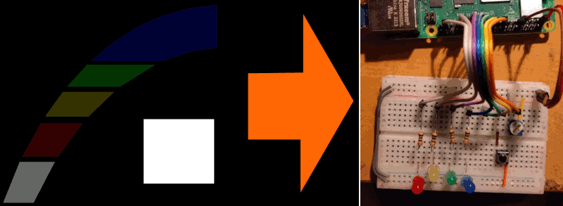

# Raspberry Pi GPIO Display

## The project

The goal of this project is to use a raspberry pi with a touch display as a simple to adjust hardware interface, mapping the Raspberrry Pi's GPIO pins seamlessly to elements on the screen.

The main sub-goals are:
- Use a web interface to enable the use of advanced designer use
- Make everything easy to adjust and extend!
- Just provide the data and let the UI decide what to do with it
- Don't care about security or multi-user (the RPi has no external network connection)

## Structure

My approach here is to use the Raspberry Pi's `pinctrl` command via a php script and provide functions to read and write via the web service. 

Along the webservice, the Raspberry Pi also launches a Chromium browser to display the UI on the connected touch screen.

The UI is a simple HTML, JavaScript and SVG page provided by the web server and is starts at boot pointing to http://localhost.

## Preparing the backend

Prepare a Raspberry Pi image (newest version, 64bit) on an SD card and boot it up.

We install php (for scripting) and nginx (the web server). This would probebly also word using a lighter werp server or even php -S alone, but I know nginx a little:

```bash
sudo apt install php8.2 php8.2-common php8.2-fpm nginx
```

Next we need to let the www-data user have access to pinctrl by adding it to the gpio group and reboot the Raspberry Pi to let it take effect.

```bash
sudo adduser www-data gpio
sudo systemctl reboot
```

Now we edit the nginx default web site config to forward php files to php.

```bash
sudo nano /etc/nginx/sites-available/default
```

This is my config:

```
server {
        listen 80 default_server;
        listen [::]:80 default_server;
        root /var/www/html;
        index index.php index.html index.htm;
        server_name _;
        location / {
                try_files $uri $uri/ =404;
        }
        location ~ \.php$ {
                include snippets/fastcgi-php.conf;
                fastcgi_pass unix:/run/php/php-fpm.sock;
        }
}
```

Save, try if the configuration is okay and if so, restart the nginx service.

```bash
sudo nginx -t
sudo systemctl restart nginx
```

Now we can place the scripts to `/var/www/html/`.


## Prepare the browser

> TODO...


## Example

I used the folowing connections:

- GPIO26 -> Red LED -> 100Ω -> GND
- GPIO06 -> Yellow LED -> 100Ω -> GND
- GPIO05 -> Green LED -> 100Ω -> GND
- GPIO11 -> Blue LED -> 100Ω -> GND
- GPIO10 -> Button -> 3V3

The example UI shows a little clock that rotates through the four LEDs whenever the orange arrow on the UI is clicked. Also, the big square turns dark while the hardware button is pressed.

This is the software setup in the index.html:

```js
GPIO.init([
    { pin: 26, mode: GPIO.MODE_OUTPUT },
    { pin:  6, mode: GPIO.MODE_OUTPUT },
    { pin:  5, mode: GPIO.MODE_OUTPUT },
    { pin: 11, mode: GPIO.MODE_OUTPUT },
    { pin: 10, mode: GPIO.MODE_INPUT_PULLDOWN }
], onGpioChange, null);
```

This sets the pins 26, 6, 5 and 11 to output mode and the pin 10 to input mode with the internal pull-down resistor enabled to keep it at 0V when the button is not pressed. Passing the `onGpioChange` function as the second parameter, makes the background thread call it whenever a pin value change is detected. The third parameter would pass all pin states on every update to this function but we down't need that here.

```js
document.getElementById('btnNext').setAttribute("onclick", "onNextClick();");
onNextClick();
```

This hooks the click event of the orange error so it calls the `onNextClick` function which implements the LED clock logic. Calling the function now sets the LED outputs to their start states.

This is what happens when the orange arrow is clicked:



This is what happens when the hardware button is pressed:


